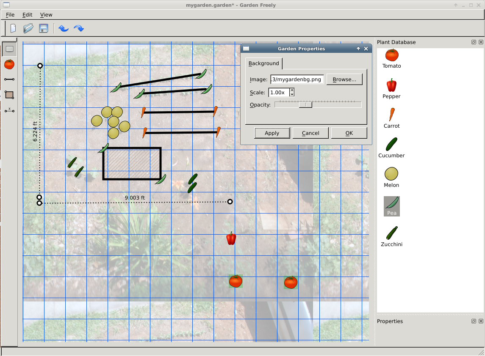

garden-freely
=============

Garden design and planning software

How to run:
---------

Requires PyQt4. On Ubuntu:

`apt-get install python-qt4`

Then:

`python gardenfreely.py`

Features
-------

* Adding Single Plants
* Rows, Rectangular plant beds, and Rulers (for measuring distances)
  * Just drag the handles to adjust
* Multiple Object Selection
* Undo/Redo any operation
* Save/Load gardens to XML file
* Grid for helping you layout
* Background images with configurable opacity 
* Print your garden plan (BETA)
* Customizable plant database (via XML)
  * Comes with 7 basic garden vegetable plants (more to come).

Screenshot
-------

How to build:
---------
(optional) - not necessary since these files are included precompiled:

`make`

This will compile the UI/resource files.
